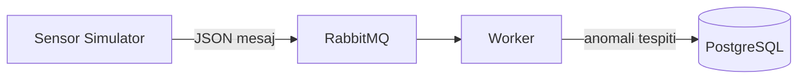
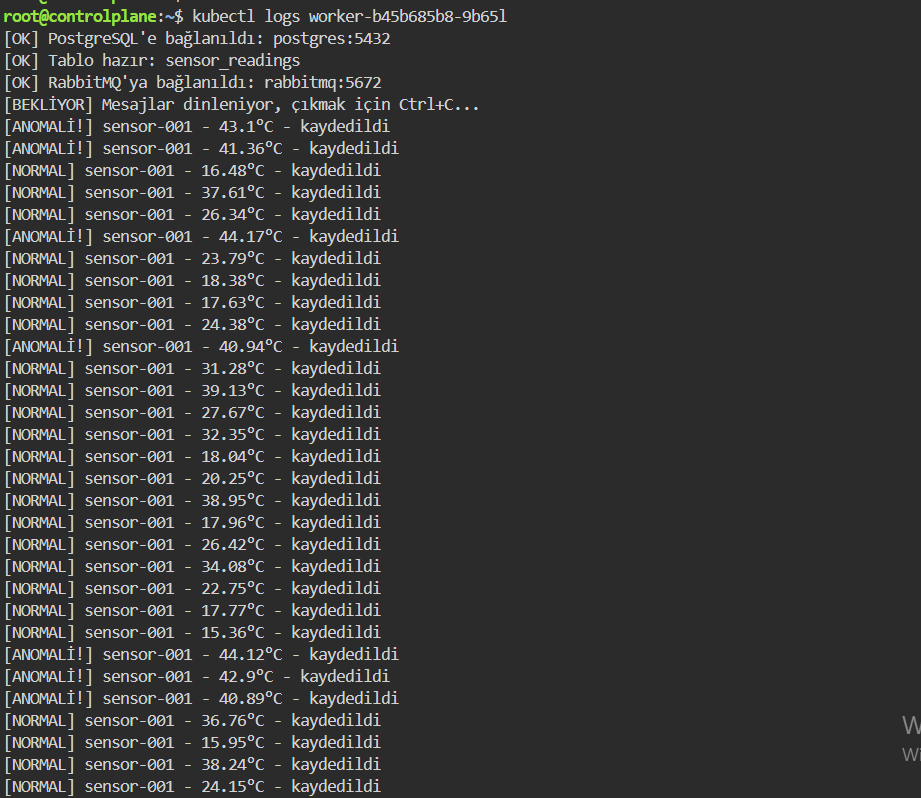
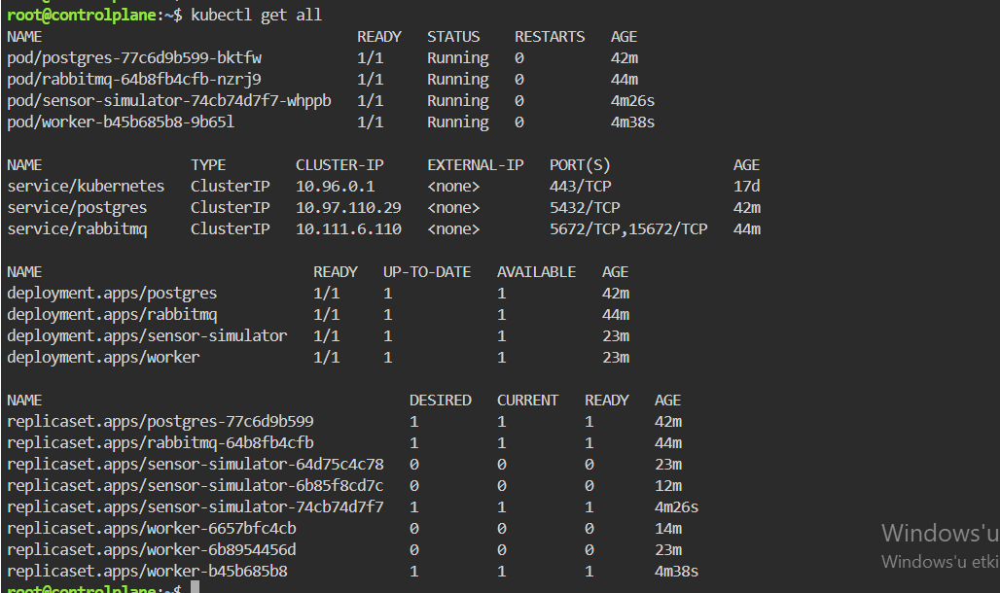

# Tactical Edge Data Pipeline

Kesinti toleranslı, container tabanlı saha veri işleme hattı. Sınırlı veya kesintili
ağ bağlantısına sahip ortamlarda (İHA, uzak üs, saha karakolu gibi edge computing
senaryolarında) çalışabilecek şekilde tasarlanmış, tamamen self-hosted ve ücretsiz
açık kaynak araçlarla kurulmuş bir sistem.

## Neden bu proje?

Savunma ve kritik altyapı ortamlarının DevOps'a yansıyan asıl problemi: kısıtlı
kaynak, kesintili ağ bağlantısı, yüksek güvenilirlik ihtiyacı. Bu proje gerçek
gizli/savunma verisiyle çalışmaz; bunun yerine bu ortamların karakteristik
problemini simüle eder ve çözer.

## Mimari



- **sensor-simulator**: sahte sensör verisi (sıcaklık, konum, batarya, sinyal gücü) üreten servis
- **RabbitMQ**: servisler arası mesaj kuyruğu, mesaj kaybını önler
- **worker**: kuyruktan veri okur, anomali tespiti yapar, PostgreSQL'e yazar
- **PostgreSQL**: işlenmiş verinin kalıcı olarak saklandığı veritabanı

## Teknoloji yığını

Python, Docker & Docker Compose, RabbitMQ, PostgreSQL, Kubernetes, GitHub Actions (CI/CD), GitHub Container Registry

## Hızlı başlangıç

```bash
git clone https://github.com/zgulce0/tactical-edge-pipeline.git
cd tactical-edge-pipeline/infra/docker
docker compose up -d
```

Sistem ayağa kalktıktan sonra RabbitMQ yönetim paneli: `http://localhost:15672` (admin/admin123)

Worker loglarını izlemek için:

```bash
docker compose logs -f worker
```

## Klasör yapısı

```
services/
  sensor-simulator/   sahte veri üreten servis + Dockerfile
  worker/             veri işleyen servis + Dockerfile
infra/
  docker/             docker-compose.yml
  k8s/                Kubernetes Deployment/Service manifestleri
.github/workflows/    CI/CD pipeline tanımı
docs/                 ekran görüntüleri, notlar
```

## CI/CD

Her `main` branch'e push, GitHub Actions üzerinden otomatik olarak:
1. sensor-simulator ve worker'ın Docker image'larını build eder
2. GitHub Container Registry'ye (ghcr.io, ücretsiz) gönderir

Workflow tanımı: `.github/workflows/docker-build.yml`

## Kubernetes

Sistemin tüm bileşenleri (`rabbitmq`, `postgres`, `sensor-simulator`, `worker`)
Kubernetes Deployment ve Service olarak `infra/k8s/` altında tanımlıdır.

**Not:** Yerel geliştirme makinesinin donanım kısıtlaması (8GB RAM) nedeniyle
k3d ve Docker Desktop Kubernetes'in yerel kurulumlarında kararlılık sorunları
yaşandı. Bu nedenle manifestler, ücretsiz bir bulut tabanlı Kubernetes ortamı
(Killercoda) üzerinde test edilip doğrulandı — tüm 4 servis başarıyla deploy
edildi, worker'ın RabbitMQ ve PostgreSQL Service'leriyle DNS üzerinden doğru
şekilde iletişim kurduğu ve veri işlediği kanıtlandı.




Manifestleri kendi cluster'ınızda denemek için:

```bash
kubectl apply -f infra/k8s/rabbitmq.yaml
kubectl apply -f infra/k8s/postgres.yaml
kubectl apply -f infra/k8s/sensor-simulator.yaml
kubectl apply -f infra/k8s/worker.yaml
kubectl get pods
```

## Ağ kesintisi simülasyonu

Sistemin sahadaki ani bağlantı kesintilerine dayanıklılığını test etmek için
RabbitMQ bilerek durduruldu:

```bash
docker compose stop rabbitmq
```

**Bulgu:** İlk testte, worker'ın mesaj bekleme döngüsünde (`start_consuming`)
bağlantı kopması durumuna karşı koruma olmadığı ortaya çıktı ve worker çöktü.
Bu bir dayanıklılık açığıydı — kodun `try/except` bloğu sadece mesaj
gönderme/işleme sırasındaki hataları yakalıyordu, bekleme sırasındaki
bağlantı kopmalarını değil.

**Düzeltme:** `start_consuming()` çağrısı da yeniden bağlanma döngüsüne
alındı, ayrıca `OSError` (DNS çözümleme hataları dahil) yakalanacak şekilde
genişletildi.

**Sonuç:** RabbitMQ tekrar durdurulup açıldığında, hem `sensor-simulator`
hem `worker`, hiçbir manuel müdahale olmadan otomatik olarak yeniden
bağlandı ve veri akışına kaldığı yerden devam etti.

sensor-simulator | [HATA] RabbitMQ'ya bağlanılamadı, 3 saniye sonra tekrar denenecek...
sensor-simulator | [OK] RabbitMQ'ya bağlanıldı: rabbitmq:5672
sensor-simulator | [GÖNDERİLDİ] {"device_id": "sensor-001", ...}


## Karşılaşılan zorluklar ve öğrenilenler

- **RabbitMQ kimlik doğrulama hatası**: Genel "bağlanamıyor" hatası container
  loglarına bakılarak "invalid credentials" olarak teşhis edildi.
- **psycopg2 → psycopg3 geçişi**: Python 3.13 için hazır derlenmiş paket
  bulunmadığından modern alternatife geçildi.
- **Kubernetes Service ortam değişkeni çakışması**: Kubernetes'in otomatik
  enjekte ettiği `RABBITMQ_PORT` değişkeni, uygulamanın kendi tanımıyla
  çakıştı; manifestte açıkça override edilerek çözüldü.
- **Çıktı tamponlama**: Container loglarının görünmemesi `PYTHONUNBUFFERED=1`
  ile çözüldü.
- **Dayanıklılık açığı**: Ağ kesintisi simülasyonu sırasında worker'ın
  mesaj bekleme durumunda korumasız olduğu bulundu ve düzeltildi.

## Yazar

[Zeynep Gülce] — Bilgisayar Mühendisliği, DevOps Stajı Projesi